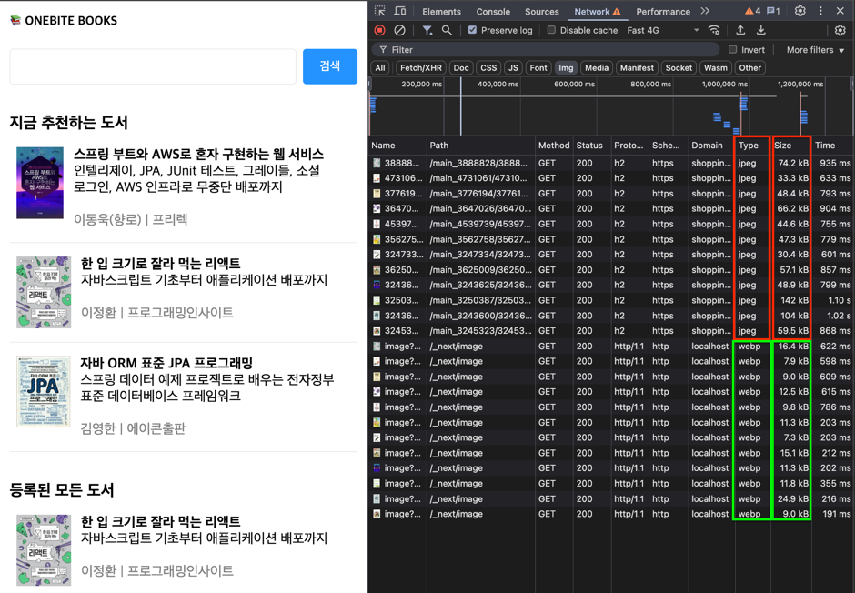

## 이미지 최적화
### Code
- as-is: ``
- to-be: `<Image src={coverImgUrl} width={80} height={105} alt={""} />`

### Config
```typescript
import type {NextConfig} from "next";

const nextConfig: NextConfig = {
  /* config options here */
  logging: {
    fetches: {
      fullUrl: true,
    }
  },
  images: {
    // deprecated
    // domains: ["shopping-phinf.pstatic.net"],
      
    // add this
    remotePatterns: [
      {
        protocol: 'https',
        hostname: 'shopping-phinf.pstatic.net',
        pathname: '**',
      }
    ]
  }
}; 

export default nextConfig;
``` 

### Result
- Optimization type(jpeg->webp), size, time, lazy loading
  